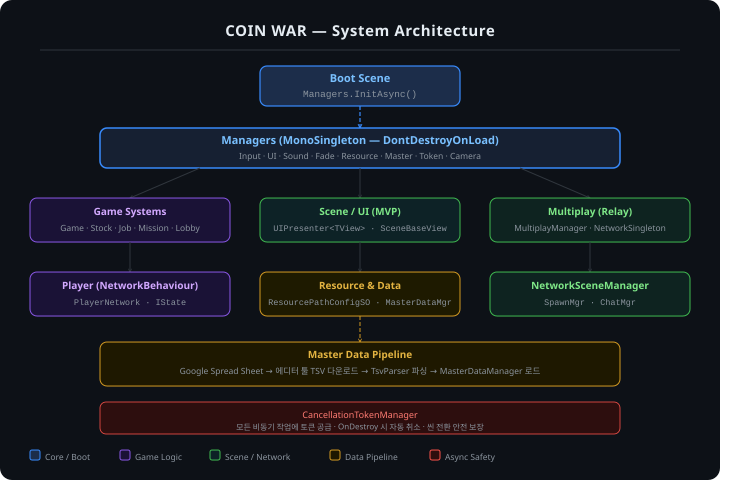

# 🪙 CoinWar

> 펭귄이 되어 동전을 모으고, 실시간으로 요동치는 주식 시장에서 부를 불리는 **온라인 멀티플레이 파티 게임**

[](https://store.steampowered.com/app/4988630/_/)


**🎮 [Steam에서 플레이하기](https://store.steampowered.com/app/4988630/_/)**

| | |
|---|---|
| **장르** | 캐주얼 · 전략 · 파티 · 대규모 멀티플레이어 (온라인 PvP) |
| **개발 / 배급** | Reverse_Time |
| **출시** | 2026.08.26 (Steam) |
| **플랫폼 / 언어** | PC (Steam) · 한국어 / English |

> 이 저장소는 실제 출시된 상용 게임 **CoinWar**의 C# 소스 중, 설계와 구현을 보여줄 수 있는 핵심 코드만 추려 공개한 포트폴리오용 저장소입니다.
> 아트·사운드·씬·서드파티 라이브러리는 포함하지 않아 단독 실행은 되지 않습니다.

---

## 🧭 게임 소개

매 라운드 **무작위 직업**을 받은 플레이어들이 맵을 돌아다니며 미니게임형 **미션**으로 코인을 모으고, 라운드 사이에 열리는 **주식 시장**에서 사고팔아 자산을 불립니다. 직업 스킬로 상대를 방해하고, 예측 못 한 이벤트를 겪으며, 전략과 운이 섞인 끝에 **최종 자산(보유 현금 + 주식 평가액)** 이 가장 많은 플레이어가 승리합니다.

### 라운드 흐름

```
RoundInfo → StockInfo → Explore → StockPurchaseAndSell → ReleaseRanking  (×N 라운드)  → Finish
 라운드 안내    주가 확인   탐험·미션·스킬     주식 매매            세금·주가 반영·순위 발표
```

| 페이즈 | 내용 |
|---|---|
| **RoundInfo** | 라운드 시작 안내 |
| **StockInfo** | 직업·미션 배정, 세금 변경, 종목별 현재 주가 확인 |
| **Explore** | 맵 탐험, 미션 수행, 직업 스킬 사용, 보급 상자·브로커 이벤트 |
| **StockPurchaseAndSell** | 모은 코인으로 주식 매수/매도 |
| **ReleaseRanking** | 세금 징수 → 주가 변동 → 총자산 기준 순위 발표 |

---

## 🏗 시스템 아키텍처



| 레이어 | 역할 |
|---|---|
| **Boot / Managers** | `Managers`(MonoSingleton, DontDestroyOnLoad)가 부팅 시 의존 순서대로 모든 매니저를 비동기 초기화 |
| **Game Systems** | Game · Stock · Job · Mission · Lobby 등 서버 권위(Server-Authoritative) 게임 로직 |
| **Scene / UI (MVP)** | `UIPresenter<TView>` + `SceneBaseView`로 View와 로직 분리 |
| **Multiplay (Relay)** | Unity Relay 기반 방 생성/참가, Netcode for GameObjects 동기화 |
| **Master Data Pipeline** | Google Spread Sheet → 에디터 툴 TSV 다운로드 → `TsvParser` → `MasterDataManager` |
| **Async Safety** | `CancellationTokenManager`로 모든 비동기 작업의 수명 관리 |

---

## 🔑 핵심 기술 포인트

### 1. 서버 권위 라운드 플로우 — UniTask 기반 비동기 상태 진행
- 호스트(서버)가 `RunGameFlow → RunRound`로 6개 `RoundPhase`를 순차 진행하고, 페이즈 전환 시 모든 클라이언트에 현재 라운드/페이즈/남은 시간을 동기화합니다.
- 모든 클라이언트가 씬 로딩을 마쳤는지 `NotifyClientReadyServerRpc`로 **Ready 핸드셰이크**를 거쳐, 전원 준비 시에만 페이드아웃과 게임 플로우를 시작합니다.
- 페이즈별 제한 시간은 코드가 아닌 **마스터 데이터(MapData)** 에서 읽어와 밸런스 조정에 코드 수정이 필요 없습니다.
- 타이머 대기와 "전원 스킵" 입력을 `UniTask.WhenAny`로 경쟁시키고, `LinkedTokenSource`로 취소를 전파합니다.
- 📄 [`GameManager.cs`](Assets/Scripts/3_Framework/NetworkManagers/GameManager.cs) · [`GameManager_Flow.cs`](Assets/Scripts/3_Framework/NetworkManagers/GameManager_Flow.cs)

### 2. 비동기 수명 관리 — `CancellationTokenManager`
- 토큰 키를 `{타입}_{인스턴스}_{작업명}`으로 구성해, **같은 작업을 다시 요청하면 이전 작업을 자동 취소**합니다(중복 실행 방지).
- `CancelAll(caller)`로 한 객체가 소유한 모든 작업을 한 번에 정리해, 씬 전환·방 종료 시 끝난 뒤 실행되는 콜백(좀비 태스크)을 막습니다.
- 📄 [`CancellationTokenManager.cs`](Assets/Scripts/3_Framework/Managers/CancellationTokenManager.cs)

### 3. 부팅 시퀀스 — 의존성 순서가 보장되는 `Managers.InitAsync`
- `Steam 초기화/라이선스 검증 → Resource → MasterData → UI/Sound/Multiplay/Fade/Input/Camera → Game/Job/Mission/Stock/Lobby/Spawn → NetworkScene` 순으로 초기화합니다. 마스터 데이터에 의존하는 매니저가 항상 그 이후에 올라오도록 순서를 고정했습니다.
- 에디터/`DEV_BUILD`에서는 Steam 검증을 건너뛰어 개발 편의를 확보하고, 릴리즈 빌드에서는 초기화·라이선스 실패 시 종료합니다.
- 📄 [`Managers.cs`](Assets/Scripts/3_Framework/Managers/Managers.cs) · [`Singleton.cs`](Assets/Scripts/3_Framework/Common/Singleton.cs) · [`MonoSingleton.cs`](Assets/Scripts/3_Framework/Common/MonoSingleton.cs)

### 4. 기획자 친화적 마스터 데이터 파이프라인 (Google Sheet → 게임)
```
Google Spread Sheet ─(에디터 윈도우: 시트 GID·범위·형식 지정)→ .tsv
   → ScriptedImporter(TextAsset화) → MasterDataTable(런타임 파싱) → MasterDataManager 조회
```
- **에디터 툴**: 시트 목록을 체크해 선택한 시트만 TSV/CSV로 내려받는 `EditorWindow`(`Tools/SpreadSheet/Download Manager`). 시트별 저장 경로·파일명은 `SheetConfig` ScriptableObject로 관리합니다.
- **자체 타입 시스템**: 1행 필드명, 2행 타입(`int` `float` `long` `bool` `string` 및 각 배열형)으로 스키마를 선언하는 규약. 새 타입은 `ParseValue`에 case 하나만 추가하면 됩니다.
- **조회 API**: 첫 컬럼을 유니크 키로 캐싱해 `GetDataByIndex` **O(1)**, 조건 검색은 predicate(`GetData` / `GetAllData`)로 제공합니다.
- 직업·스킬 파라미터·미션·주식·확률·맵 테이블이 모두 이 파이프라인을 타며, 밸런스 변경은 **시트 수정 → 다운로드**만으로 끝납니다.
- 📄 [`DataDownloder.cs`](Assets/Scripts/2_MasterData/DataDownloader/DataDownloder.cs) · [`TSVImporter.cs`](Assets/Scripts/2_MasterData/TSVImporter.cs) · [`TsvParser.cs`](Assets/Scripts/2_MasterData/TsvParser.cs) · [`MasterDataTable.cs`](Assets/Scripts/2_MasterData/MasterDataTable.cs) · [`MasterDataManager.cs`](Assets/Scripts/2_MasterData/MasterDataManager.cs)

### 5. 주식 시장 시뮬레이션 (`StockManager`)
- **가격 구간별 확률 테이블**: 현재 주가가 속한 구간에 따라 상승/하락 확률과 변동 폭(`GainRate` / `LossRate`)을 마스터 데이터에서 조회합니다. 가중 랜덤으로 방향을 정한 뒤 구간별 범위 안에서 변동률을 뽑으므로, 코드 수정 없이 시장의 성격을 조정할 수 있습니다.
- **시장 충격(Market Impact)**: 한 종목을 많이 보유할수록(10주당 +1%, 최대 +10%p) 하락 시 낙폭이 커지는 페널티를 둬 독점 매수 전략을 견제합니다.
- 변동 결과는 100 단위로 절사하고 하한(1,000)을 두며, 이전 가격(`BeforePrice`)을 함께 보관해 UI의 등락 표시에 사용합니다.
- 계산은 서버에서만 수행하고 `NetworkList`/RPC로 전파하며, 매수·매도 이벤트는 스트림(`UniRx`)으로 발행해 UI가 구독합니다.
- 총자산 = 보유 현금 + Σ(종목 현재가 × 보유 수량). 라운드 종료 시 세금과 주가 반영 **후** 순위를 계산합니다.
- 📄 [`StockManager.cs`](Assets/Scripts/3_Framework/NetworkManagers/StockManager.cs)

### 6. 데이터 주도 직업·스킬 시스템
- 8개 직업(`FryingPanKiller` `InsanePharmacist` `Gambler` `Police` `Hacker` `Recluse` `Thief` `Gangster`)이 각자 `JobSkillBase`를 상속한 스킬 클래스를 갖고, **쿨타임·범위·수치는 `JobSkillTable`에서 주입**됩니다.
- 직업 배정은 매번 `Random`을 굴리지 않고 **셔플한 큐에서 Dequeue**하여, 한 판에서 같은 직업이 겹치지 않고 편향 없이 분배되도록 했습니다(인원이 직업 수를 넘는 경우만 중복 허용).
- 직업마다 전용 미션이 따로 배정됩니다(일반 미션 5개 + 직업 미션 1개 랜덤).
- 📄 [`JobManager.cs`](Assets/Scripts/3_Framework/NetworkManagers/JobManager.cs) · [`MissionManager.cs`](Assets/Scripts/3_Framework/NetworkManagers/MissionManager.cs)

### 7. 네트워크 스킬 판정 — 중복 적용 레이스 컨디션 해결 (`SkillReceiveGate`)
- **문제**: 스턴·슬로우·중독은 `RPC → Owner의 NetworkVariable 변경 → 재복제`까지 여러 프레임이 걸립니다. 그 사이 `CanReceive()`는 계속 true라, 같은 프레임에 겹친 설치물(껌 2개)이나 스킬 연타가 모두 판정을 통과해 **효과가 중복 적용**되고 설치물이 여러 개 파괴됐습니다.
- **해결**: 수신 "접수 즉시" 로컬에서 잠그는 경량 게이트(`TryAcquire` / `Release`)를 도입해 그 창을 닫고, `Release` 유실에 대비한 **자동 해제 타임아웃(`Tick`)** 을 두어 데드락을 방지했습니다.
- 스킬 대상 탐색은 `SingleSkillScanner` / `MultiSkillScanner` / `ObjectSkillScanner`로 추상화했고, 설치형 스킬은 `DeployObject`(껌, 독)로 일반화했습니다. 플레이어 행동은 `IState` 기반 FSM으로 관리합니다.
- 📄 [`SkillReceiveGate.cs`](Assets/Scripts/1_InGame/Player/SkillReceiveGate.cs) · [`SingleScanner.cs`](Assets/Scripts/1_InGame/Player/Scanner/SingleScanner.cs) · [`DeployObject.cs`](Assets/Scripts/1_InGame/Skills/DeployObject.cs) · [`IState.cs`](Assets/Scripts/1_InGame/Player/IState.cs)

### 8. 미션 시스템 — 14종 이상의 미니게임을 공통 틀로
- 키패드, 패턴 클릭, 드래그 앤 드롭, 낚시, 순간 암산, 가열 체크, 숫자 배틀, 가격 계산, 퍼즐, 가위바위보, 문지르기, 텐트 말뚝 박기, 도구 제거, 해커 전용 미션 등.
- `MissionUIBase`에 공통 흐름을 두고, 드래그/드롭·툴 구동 계열은 `UIDragItem` / `UIDropSlot` / `UIDriver` 등 **재사용 컴포넌트**로 조립해 새 미션 추가 비용을 낮췄습니다.
- `MissionResolver`가 미션 진행 조건을 판정하고, 맵의 미션 오브젝트는 `MissionManager`에 등록·해제(`Register` / `UnRegister`)되어 관리됩니다.
- 📄 [`Assets/Scripts/1_InGame/UI/MissionUI`](Assets/Scripts/1_InGame/UI/MissionUI) · [`MissionResolver.cs`](Assets/Scripts/1_InGame/Mission/MissionResolver.cs)

### 9. 멀티플레이 연결 — Relay + Connection Approval
- 호스트는 Relay Allocation과 Join Code를 발급하고, 클라이언트는 코드로 접속합니다. 최대 인원은 2~8명으로 제한(`Clamp`)합니다.
- `ConnectionApprovalCallback`에서 **방이 가득 찼거나, 이미 게임이 시작된 경우 접속을 거부**하고 사유를 클라이언트에 전달합니다.
- 접속 대기는 `UniTask.WaitUntil` + 10초 `Timeout`으로 처리하고, 이벤트 구독은 `finally`에서 반드시 해제합니다. 초기화 중복 호출은 하나의 `UniTask`를 공유해 막습니다.
- 📄 [`MultiplayManager.cs`](Assets/Scripts/3_Framework/NetworkManagers/MultiplayManager.cs) · [`LobbyManager.cs`](Assets/Scripts/3_Framework/NetworkManagers/LobbyManager.cs) · [`NetworkSceneManager.cs`](Assets/Scripts/3_Framework/NetworkManagers/NetworkSceneManager.cs)

### 10. UI 구조 — MVP + 레이어 기반 UIManager
- `UIPresenter<TView>`가 View를 바인딩하고, 소유한 `CancellationTokenSource`를 `Dispose`에서 정리해 UI가 닫힐 때 진행 중이던 비동기 작업도 함께 종료됩니다.
- `UIManager.Open<T>(layer)`로 UI를 레이어(Popup 등) 단위로 비동기 로드·관리하고, 드래그/픽 상태와 알림 큐도 중앙에서 다룹니다.
- 📄 [`UIPresenter.cs`](Assets/Scripts/3_Framework/Base/UIPresenter.cs) · [`UIManager.cs`](Assets/Scripts/3_Framework/Managers/UIManager.cs) · [`SceneBaseView.cs`](Assets/Scripts/1_InGame/Scene/SceneBaseView.cs)

---

## 🛠 기술 스택

| 분류 | 사용 기술 |
|---|---|
| **엔진 / 언어** | Unity (2D), C# |
| **네트워크** | Netcode for GameObjects, Unity Relay / Authentication (UGS), Steamworks.NET |
| **비동기 / 반응형** | UniTask, UniRx |
| **연출 / 오디오** | DOTween, FMOD |
| **입력 / 현지화** | Unity Input System, Unity Localization (KO / EN) |
| **데이터** | Google Spread Sheet → TSV, ScriptedImporter, ScriptableObject |
| **빌드 / 배포** | 커스텀 빌드 스크립트(`BuildScript`), Steam |

## 📁 저장소 구조

```
Assets
├─ Editor/                         # 에디터 툴 (시트 다운로더, TSV 임포터, 씬 컨트롤)
└─ Scripts
   ├─ 1_InGame/                    # 인게임 로직
   │   ├─ Player/ · Skills/        # 플레이어, FSM, 스킬 수신/판정, 설치형 스킬
   │   ├─ Mission/ · Object/       # 미션 판정, 상호작용 오브젝트
   │   ├─ Maps/ · Camera/ · Sound/ # 존/맵 데이터, 카메라, 사운드
   │   ├─ Scene/                   # Scene View (Boot/Title/Lobby/Main)
   │   └─ UI/                      # 미션 UI, 라운드 리포트, 로비, 미니맵 등
   ├─ 2_MasterData/                # 마스터 데이터 파이프라인
   └─ 3_Framework/                 # 핵심 프레임워크
       ├─ Managers/                # Managers, UI, Sound, Resource, Input, Token ...
       ├─ NetworkManagers/         # Game, Stock, Job, Mission, Lobby, Spawn, RPC ...
       ├─ Common/ · Base/          # Singleton, DisposableContainer, UIPresenter
       └─ Util/ · EditorTools/     # 확장 메서드, 정의, 빌드 도구
```

## ⚠️ 참고

- 상용 게임의 소스 일부를 발췌한 저장소로, 에셋과 서드파티(UniTask, UniRx, DOTween, FMOD, Steamworks.NET 등)는 각 라이선스에 따라 제외했습니다.
- 마스터 데이터(시트 원본)와 스프레드시트 주소는 공개하지 않았습니다.

---

<p align="center">
  <a href="https://store.steampowered.com/app/4988630/_/"><b>▶ CoinWar on Steam</b></a>
</p>
